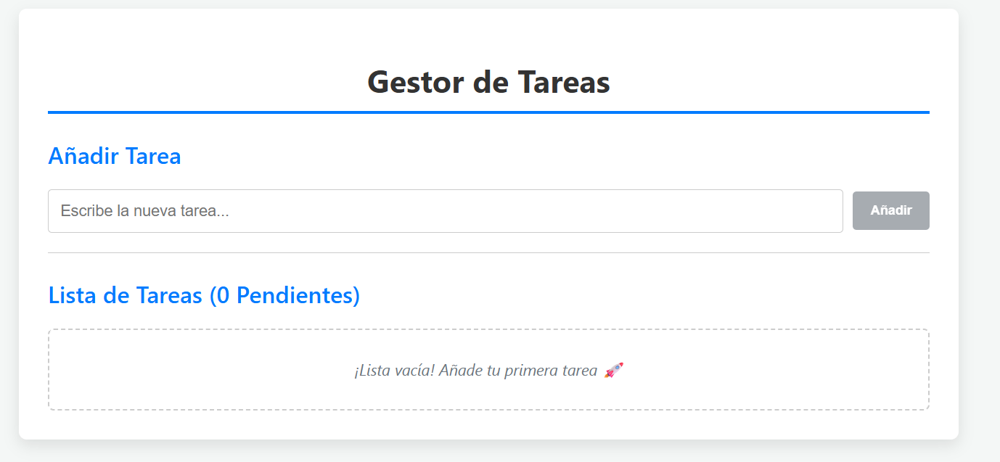
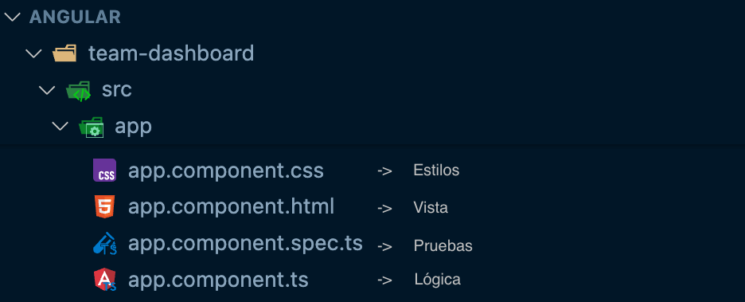
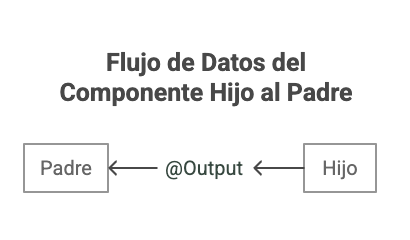

<style scoped>
  h1 strong {
    color: #fbfbfb
  }
  p {
    color: #fff
  }
</style>


# **Turoria 02**

Componentes y plantillas en Angular

---

<!-- backgroundColor: #f6f7f9 -->

# Objetivos

- Entender la estructura y anatomía de los componentes en Angular (clase, plantilla, selector, estilos)
- Aplicar interpolación de texto y property binding
- Construir componentes y entender el sistema de imports
- Dominar la comunicación entre componentes usando @Input y @Output
- Implementar el ciclo de vida de los componentes

---

<style scoped>
  p {
    text-align: center
  }
  img {
    width: 80%
  }
</style>

# Aplicación



---

# ¿Qué es un Componente?

- Un **componente** en Angular es un **bloque de código reutilizable** que combina lógica, datos y presentación.
- Técnicamente, es una clase TypeScript decorada con `@Component` que encapsula datos (propiedades), comportamiento (métodos) y vista (plantilla)

---

<style scoped>
  p {
    text-align: center
  }
</style>

# Estructura de un Componente



---

# Anatomía de un Componente

```typescript
import { Component } from '@angular/core'

@Component({
  selector: 'profile-photo', // Selector CSS
  template: ``, // Template HTML
  styles: `img { border-radius: 50%; }`, // Estilos CSS (opcional pero recomendado)
})
export class ProfilePhoto {
  // Clase TypeScript con comportamientos
}
```

---

# ¿Qué es una Plantilla?

Una **plantilla** es un archivo HTML que define cómo se debe renderizar la vista de un componente. Las plantillas combinan HTML estándar con sintaxis especial de Angular como:

- Interpolación `{{ }}`
- Property Binding `[ ]`
- Event Binding `( )`
- Directivas Estructurales `*ngFor`, `*ngIf`

---

# Plantilla inline

```typescript
@Component({
  selector: 'greeting-card',
  template: `
    <div class="card">
      <h2>{{ title }}</h2>
      <p>{{ message }}</p>
    </div>
  `,
  styles: `.card { padding: 20px; }`
})
```

---

# Archivos separados

```typescript
@Component({
  selector: 'greeting-card',
  templateUrl: './greeting-card.component.html',
  styleUrl: './greeting-card.component.css'
})
```

---

<style scoped>
  p {
    text-align: center
  }
  img {
    width: 50%
  }
</style>

# @Input


---

<style scoped>
  p {
    text-align: center
  }
  img {
    width: 50%
  }
</style>

# @Output



---

# Interpolación de Texto

La **interpolación** permite insertar valores dinámicos en el HTML usando la sintaxis `{{ }}`.

```typescript
export class UserComponent {
  userName = 'María García';
  age = 28;
  
  getGreeting() {
    return `Bienvenida, ${this.userName}!`;
  }
}
```

```html
<h1>{{ userName }}</h1>
<p>Edad: {{ age }}</p>
<p>{{ getGreeting() }}</p>
```

---

# Property Binding

El **property binding** vincula propiedades del componente a propiedades del DOM usando `[ ]`.

```typescript
export class ImageComponent {
  imageUrl = 'https://example.com/photo.jpg';
  isDisabled = false;
  altText = 'Foto de perfil';
}
```

```html

<button [disabled]="isDisabled">Guardar</button>
```

---

# Event Binding

El **event binding** permite responder a eventos del usuario usando `( )`.

```typescript
export class CounterComponent {
  count = 0;
  
  increment() {
    this.count++;
  }
  
  handleClick(event: MouseEvent) {
    console.log('Botón clickeado', event);
  }
}
```

```html
<button (click)="increment()">Incrementar</button>
<p>Contador: {{ count }}</p>
<button (click)="handleClick($event)">Click aquí</button>
```

---

# @Input - Comunicación Padre → Hijo

El decorador **@Input** permite que un componente hijo reciba datos del componente padre.

```typescript
// Componente hijo
import { Component, Input } from '@angular/core';

@Component({
  selector: 'user-card',
  template: `
    <div class="card">
      <h3>{{ userName }}</h3>
      <p>{{ userEmail }}</p>
    </div>
  `
})
export class UserCardComponent {
  @Input() userName: string = '';
  @Input() userEmail: string = '';
}
```

---

# Uso de @Input

```typescript
// Componente padre
@Component({
  selector: 'app-root',
  template: `
    <user-card 
      [userName]="'Juan Pérez'" 
      [userEmail]="'juan@example.com'">
    </user-card>
  `
})
export class AppComponent {}
```

**Ventajas:**
- Reutilización de componentes
- Componentes más flexibles y configurables
- Separación clara de responsabilidades

---

# @Output - Comunicación Hijo → Padre

El decorador **@Output** permite que un componente hijo emita eventos al componente padre.

```typescript
// Componente hijo
import { Component, Output, EventEmitter } from '@angular/core';

@Component({
  selector: 'counter-button',
  template: `
    <button (click)="handleClick()">
      Incrementar
    </button>
  `
})
export class CounterButtonComponent {
  @Output() counterChange = new EventEmitter<number>();
  private count = 0;
  
  handleClick() {
    this.count++;
    this.counterChange.emit(this.count);
  }
}
```

---

# Uso de @Output

```typescript
// Componente padre
@Component({
  selector: 'app-root',
  template: `
    <h2>Total: {{ total }}</h2>
    <counter-button (counterChange)="onCounterChange($event)">
    </counter-button>
  `
})
export class AppComponent {
  total = 0;
  
  onCounterChange(newValue: number) {
    this.total = newValue;
    console.log('Nuevo valor:', newValue);
  }
}
```

---

# Ciclo de Vida de Componentes

Angular proporciona **hooks del ciclo de vida** para ejecutar código en momentos específicos:

- **ngOnInit**: Se ejecuta una vez después de la inicialización
- **ngOnChanges**: Se ejecuta cuando cambian los @Input
- **ngOnDestroy**: Se ejecuta antes de destruir el componente
- **ngAfterViewInit**: Se ejecuta después de inicializar la vista
- **ngDoCheck**: Detección de cambios personalizada

---

# Ejemplo de Ciclo de Vida

```typescript
import { Component, OnInit, OnDestroy, Input, OnChanges } from '@angular/core';

@Component({
  selector: 'lifecycle-demo',
  template: `<p>{{ message }}</p>`
})
export class LifecycleDemoComponent implements OnInit, OnDestroy, OnChanges {
  @Input() data: string = '';
  message = '';
  
  ngOnChanges() {
    console.log('ngOnChanges: Input cambió', this.data);
  }
  
  ngOnInit() {
    console.log('ngOnInit: Componente inicializado');
    this.message = 'Componente listo';
  }
  
  ngOnDestroy() {
    console.log('ngOnDestroy: Limpiando recursos');
  }
}
```

---

# Buenas Prácticas

✅ **Usar nombres descriptivos** para selectores y componentes
✅ **Separar plantillas y estilos** en archivos cuando sean extensos
✅ **Mantener componentes pequeños** y con una sola responsabilidad
✅ **Usar @Input/@Output** para comunicación entre componentes
✅ **Implementar OnDestroy** para limpiar suscripciones y timers
✅ **Evitar lógica compleja** en las plantillas
✅ **Usar tipos TypeScript** para @Input y @Output

---

# Sistema de Imports

Angular usa un sistema modular. Los componentes deben ser:

1. **Declarados** en un módulo o standalone
2. **Importados** donde se necesiten

```typescript
// Componente standalone (Angular 14+)
@Component({
  selector: 'my-component',
  standalone: true,
  imports: [CommonModule, FormsModule],
  template: `...`
})
export class MyComponent {}
```

---

# Ejercicio Práctico

Crear un componente de **lista de tareas** que:

1. Muestre una lista de tareas
2. Permita agregar nuevas tareas
3. Permita marcar tareas como completadas
4. Use @Input para recibir tareas iniciales
5. Use @Output para notificar cambios al padre
6. Implemente interpolación, property binding y event binding

---

# Recursos Adicionales

- 📚 [Documentación oficial de Angular](https://angular.dev)
- 🎓 [Angular Component Guide](https://angular.dev/guide/components)
- 💡 [Angular Style Guide](https://angular.dev/style-guide)
- 🔧 [Angular CLI](https://angular.dev/cli)

---

# Preguntas y Respuestas

¿Dudas sobre componentes, plantillas o comunicación entre componentes?